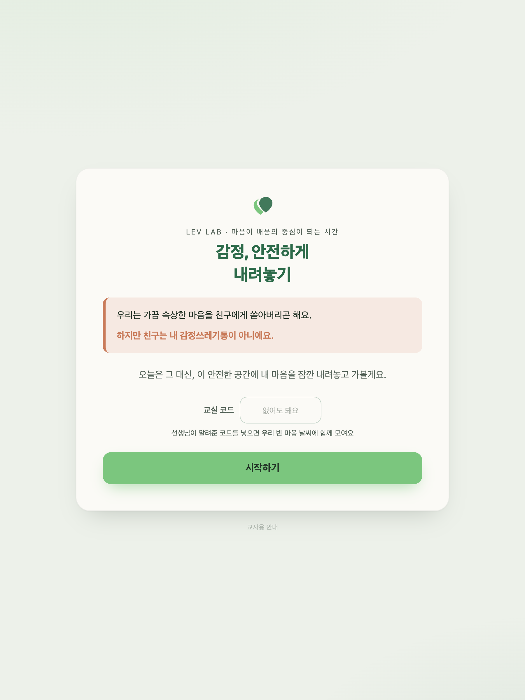
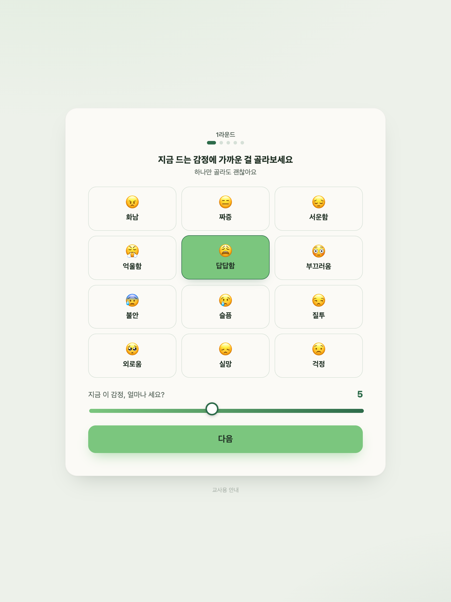
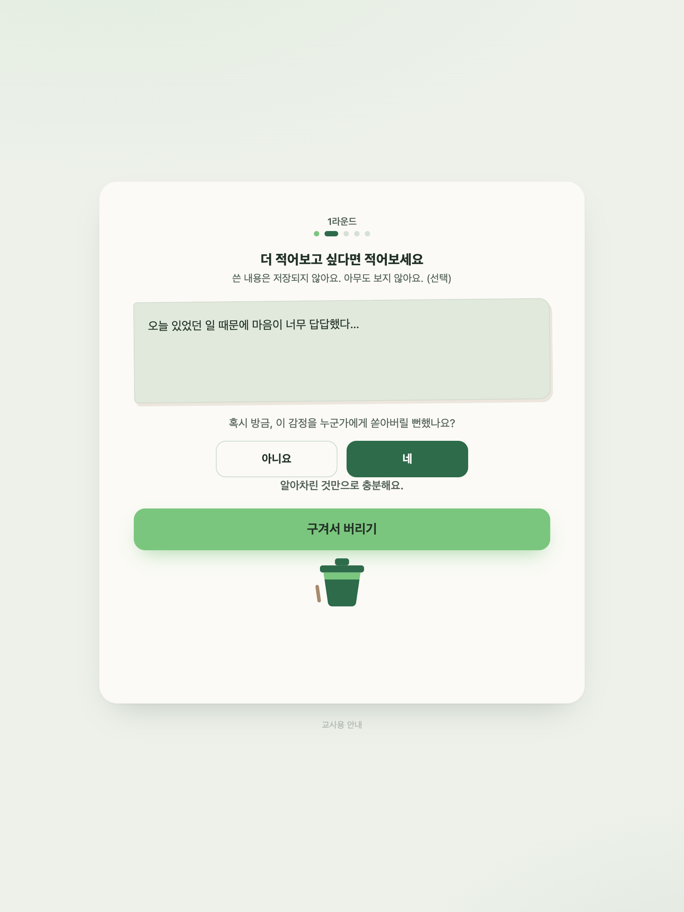

# 감정, 안전하게 내려놓기

> **"친구는 내 감정쓰레기통이 아니에요."**
> 속상한 감정을 친구에게 쏟는 대신, 안전한 공간에 적고 구겨서 버려보는 중학생 사회정서교육(SEL) 수업 활동입니다.

**👉 바로 사용하기: https://cleveranawim-source.github.io/emotion-release/**

설치, 로그인, 회원가입이 전혀 필요 없습니다. 링크 하나로 수업에서 바로 쓸 수 있습니다.

## 화면 미리보기

| 시작 화면 | 감정 고르기 (12종) |
|:---:|:---:|
|  |  |

| 적고 버리기 | 교사 발표 모드 (QR + 실시간) |
|:---:|:---:|
|  |  |

---

## 활동 흐름 (5단계 × 최대 3라운드)

1. **감정 고르기** — 12가지 감정 이모지 타일 (화남 😠 짜증 😑 서운함 😔 억울함 😤 답답함 😩 부끄러움 😳 불안 😰 슬픔 😢 질투 😒 외로움 🥺 실망 😞 걱정 😟) + 강도 재기 (1~10)
2. **적고 버리기** 🗑 — 원하면 마음을 글로 적고(어디에도 저장되지 않아요), 쪽지를 구겨서 쓰레기통에 버립니다
3. **다시 강도 재기** — 내려갔든, 그대로든, 오히려 올라갔든 괜찮다고 말해주는 피드백
4. **대처법 고르기** — 8가지 대처법 타일 (심호흡 🌬️ 잠깐 걷기 🚶 물 마시기 💧 음악 듣기 🎵 일기 쓰기 📝 그림 그리기 🎨 스트레칭 🧘 믿을 수 있는 사람에게 말하기 💬)
5. **잠깐 숨 고르기** — 호흡 원과 함께 들이쉬고, 내쉬고

라운드가 끝나면 **우리 반 마음 날씨**(이름 없이 감정만 모인 우리 반 그래프)를 함께 봅니다.
학생이 원하면 최대 3라운드까지 반복할 수 있고, 1라운드만 하고 넘어가도 됩니다. 20분 활동 기준 1~2라운드가 적당합니다.

## 수업에서 쓰는 법 (교사용)

1. 프로젝터로 위 링크를 열고, 화면 아래 흐릿한 **"교사용 안내"** 를 클릭합니다
2. **"발표 모드 열기"** → 교실 코드와 QR이 화면에 크게 표시됩니다
3. 학생들이 휴대폰·태블릿 카메라로 QR을 찍으면 코드가 자동 입력된 채 활동이 시작됩니다
4. 학생들이 감정을 버릴 때마다 앞 화면의 **우리 반 마음 날씨가 실시간으로 차오릅니다**

- 교실 코드는 자동 생성된 것을 그대로 쓰는 걸 권장합니다 (다른 교실과 겹치지 않도록)
- 교실 코드 없이 열면 **개인 활동 모드**로 동일하게 진행됩니다 (기록은 각자 기기에만 남음)
- 인터넷이 끊겨도 활동 자체는 끊기지 않습니다 (집계만 로컬로 전환)

## 수업 지도안 (45분 기준)

| 단계 | 시간 | 내용 |
|------|------|------|
| 도입 | 5분 | 발문: "쓰레기를 아무 데나 버리면 어떻게 될까?" → "감정도 똑같아요. 아무 데나 쏟으면 누군가 맞아요." |
| 전개 1 | 5분 | 발표 모드를 켜고 QR 접속 안내, 활동 방법 시연 |
| 전개 2 | 15분 | 학생 개별 활동 (1~2라운드, 자기 속도대로) |
| 정리 1 | 10분 | 우리 반 마음 날씨를 함께 보며 이야기 나누기 — "혼자만 느끼는 감정이 아니었네요" |
| 정리 2 | 10분 | 오늘 고른 대처법 나누기, 마무리 약속: "친구의 감정도 함부로 받지도, 아무 데나 쏟지도 않기" |

**다음 차시 확장 아이디어**: "오늘 버린 감정 중, 사실은 배움이 되는 감정도 있었을까?" — 감정을 재활용/일반/유해로 분류해보는 활동으로 연결할 수 있습니다.

## 개인정보와 안전

이 도구는 처음부터 "안전한 익명 공간"으로 설계되었습니다.

- 학생이 쓴 **글**: 저장·전송되지 않습니다. 브라우저 안에서만 존재하고 사라집니다
- **예/아니요 자가 점검**: 그 누구에게도(교사 포함) 보이지 않습니다
- 반으로 모이는 것: **감정 종류별 개수와 횟수뿐**입니다 — 이름, 학번, 기기 정보 없음
- 로그인, 회원가입, 쿠키 추적 없음

## 직접 호스팅하기 (선택)

`index.html` 파일 하나가 전부입니다. 복사해서 어디든 올리면 그대로 작동합니다.

반 집계(마음 날씨) 기능을 자신의 Firebase로 운영하려면:

1. [Firebase 콘솔](https://console.firebase.google.com)에서 프로젝트 생성 → Firestore 활성화
2. `index.html`의 `FIREBASE_CONFIG` 값을 자신의 것으로 교체
3. Firestore 보안 규칙에 추가:

```
match /emotion_release/{doc} {
  allow read, write: if true;
}
```

## 만든 사람

**명지중 Chaplain YEOL** — Lev Lab, 마음이 배움의 중심이 되는 시간을 만듭니다.

## 라이선스

[MIT](LICENSE) — 자유롭게 수정·배포하세요. 더 많은 교실에서 쓰이길 바랍니다.
